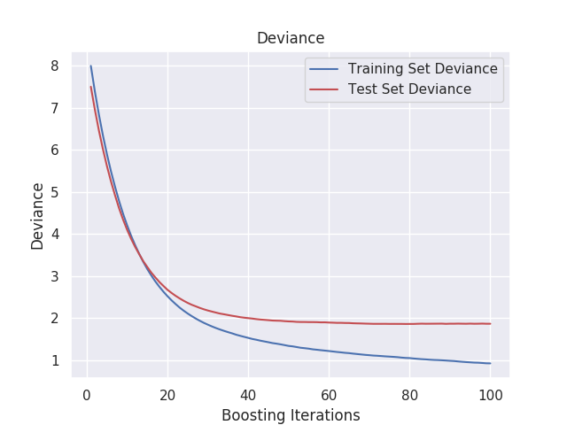

# cebd1160: Students performance analysis

| Name   | Date |
|:-------|:---------------|
|Lan Xu       | March 21, 2020|
|Reeta Sharma | March 21, 2020|

-----

### Resources

- Python script for your analysis: `student_performance.py`
- Jupyter notebook script: `TeamProject_student_performance.ipynb`
- Results figure/saved file: `plots/` 
- Dockerfile for your experiment: `Dockerfile`
- runtime-instructions in a file named RUNME.md

-----

## Research Question

By providing data attributes including student grades, demographic, social and school related features, can we predict a student's final academic performance?

### Abstract 

Education has been the subject of constant research by schools and parents. A student's academic performance seems to be affected by many factors. This project uses a real data set collected from two middle schools in Portugal. By using these data, we may be able to find the main factors that affect students' academic performance and better provide ideas for educational innovation.
Through a visual analysis of the data, we got many interesting findings. However, the model established by preliminary machine learning, after removing the features of previous academic scores, the prediction performance is not satisfactory. But our research results are still meaningful, and it provided ideas for us to continue to study the other influencing factors of student performance.

### Introduction

The [dataset](https://archive.ics.uci.edu/ml/datasets/student+performance) we used in this project is from UCI Machine Learning Repository. This data approach student achievement in secondary education of two Portuguese schools. The data attributes include student grades, demographic, social and school related features and it was collected by using school reports and questionnaires. Two datasets are provided regarding the performance in two distinct subjects: Mathematics (mat) and Portuguese language (por). 

### Methods

* First of all, we merged both datasets into one dataset and added an extra column 'subject'. After plotting the correlation heatmap we got a general idea of our data and then through the visual analysis, we got some interesting findings (see Python code for details). 

* Then we used [dummy encoding](https://pandas.pydata.org/pandas-docs/stable/reference/api/pandas.get_dummies.html) method to convert data type from categorical type to numerical type before modeling the data. Because predicting students final grade is a regression task, so after estimators comparison by [cross-validation](https://scikit-learn.org/stable/modules/cross_validation.html) in scikit-learn, we chose Ensemble Decision Tree - *Gradient Boosting Regressor* which had the highest score in the comparison. 
Gradient Boosting Regressor is an python built-in model in scikit-learn. The Pseudocode can be found [here](https://scikit-learn.org/stable/modules/generated/sklearn.ensemble.GradientBoostingRegressor.html). 
The main idea of GBR is to optimization of arbitrary differentiable loss functions and in each stage a regression tree is fit on the negative gradient of the given loss function.

* By choosing GBR estimator, we then used grid search to tune the hyper-parameter which is in order to train a model with best performance. 

* We basicly trained model with 3 different features combination.
    1. Keep all the features.  
    2. Keep all other features only remove G2. 
    3. Keep all other features only remove G1 and G2. 
    4. Keep only G1 and G2 two features.  

* The last, we tried an classification task to predict if a student has a boyfriend or girlfriend. The same logic we used as GBR, based on CV score and grid search for tuning the parameters, we also used a sciket-learn built in estimator called [GradientBoostingClassifier](https://scikit-learn.org/stable/modules/generated/sklearn.ensemble.GradientBoostingClassifier.html). 

### Results

Here we list few figures we plotted:

 

> Above figure shows that people prefer to marry with similar education background person. This might because people with similar education may have more interests in common. And it also shows that the divorce rate is almost 50% high in each group. 

 

> From this plot we can see that the students who go out rarely has the minimal fluctuations in grades but not the best grade group. The best group is going out on low level but still spend sometime with friends.
> And all the groups the top grade students almost no alcohol consumption or at a lower level. With the frequency of going out creasing, the alcohol assumption is increasing too. 

 

> Above plots show:
> * For extra classes, parents paid more on Math and very little paid on Portuguese.
> * Male students have higher performance on Math and Female students have higher performance on Portuguese.
> * Mother's job is health related, their kids have best performance and Father's job is teacher related, their kids has best performance.

 

> From above figure we can see that the students who spent more time on the way to school have lower grades. And most of the students live near school and students who live in Rural are normally have more travel time than students live in Urban.

As far as the prediction model is concerned, if all the features are retained, and the prediction model reached almost the same performance as the model that only keep G1 and G2. 
prediction output is:  
MAE error(avg abs residual): 0.6908200262887249  
MSE error: 0.8524509219723027  
RMSE error: 0.9232826880063888  
R2 Score: 0.8948780406468524

  
   

If one previous score (G2) is removed, the accuracy of the model prediction will be reduced.  
prediction output is:  
MAE error(avg abs residual): 1.1506345531457294  
MSE error: 2.225371125281547  
RMSE error: 1.4917677853076017  
R2 Score: 0.7543110912228154

  
   

If both test scores (G1 and G2) are all removed, the prediction ability of the model will be greatly reduced, and it will not have the value of prediction.  
prediction output is:  
MAE error(avg abs residual): 2.03813918871276  
MSE error: 6.668111185732786  
RMSE error: 2.582268612234751  
R2 Score: 0.27309841477549357

  
   

Regarding the classification task to predict if a student has a boyfriend or girlfriend. The output is:   

Classification Report  
           
|              | precision | recall | f1-score | support |
|:------------:|:---------:|:------:|:--------:|:-------:|
|       0      |    0.81   |  0.86  |   0.83   |   201   |
|       1      |    0.66   |  0.58  |   0.62   |    97   |
|   accuracy   |           |        |   0.77   |   298   |
|   macro avg  |    0.73   |  0.72  |   0.72   |   298   |
| weighted avg |    0.76   |  0.77  |   0.76   |   298   |

Confusion Matrix 

  

### Discussion

From the analysis of the different steps, we conclude: 

1. If we collect only students' previous grade (G1 and G2), we can build up a good prediction model to predict students' final grade. 
2. The above conclusion doesn't mean this data set has no research value. Because from the data visualization, we get a lot of interesting findings. Although these findings are not always to do with academic score, they still show the value of social research: the differences in learning between boys and girls can provide better educational ideas for parents and schools. Maybe boys need more exercise than just extending study time to improve performance. And for boys and girls in different subjects, can schools or families provide different help. For children who do not like to socialize, they can properly develop their social skills, which will help improve their academic performance, but parents and school need to supervise problems such as alcoholism caused by improper socialization, etc. 
3. Predicting student next academic score with previous academic is definately the most effective and low-cost method. However, as a more in-depth study of the factors affecting a student's performance, this data did not find the most important features. 

Suggest: Based on the above research analysis, we think that in data collection, it should consider the student's 'IQ', 'EQ', or 'communication ability', etc. These may be important factors that affect a student's academic performance. In the future, We hope to be able to make accurate predictions of students' academic performance when there is no grades related information. 

### References
https://scikit-learn.org/stable/auto_examples/ensemble/plot_gradient_boosting_regression.html#sphx-glr-auto-examples-ensemble-plot-gradient-boosting-regression-py

All the other links referenced were included in my discussion, above.

-------